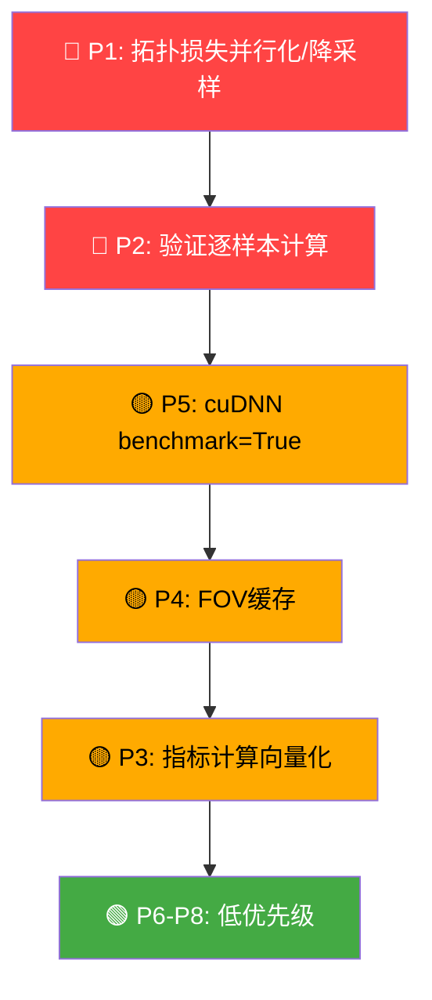

# 🔍 VesselSeg_UnetTopo 性能问题分析报告

> **分析范围**: 仓库全部核心代码（8个Python文件 + 配置）
> **分析日期**: 2026-04-11

---

## 问题总览

| # | 严重度 | 类别 | 问题 | 主要文件 |
|---|--------|------|------|----------|
| P1 | 🔴 高 | 计算瓶颈 | 拓扑损失逐样本串行CPU计算 | `topology_loss_fragment_suppress.py` |
| P2 | 🔴 高 | 内存 | 验证阶段全量预测堆积在GPU → 一次性搬运 | `train_topo_roi.py` |
| P3 | 🟡 中 | 计算冗余 | 验证时骨架化/连通域分析重复计算 | `utils_metrics.py` |
| P4 | 🟡 中 | 数据加载 | FOV椭圆拟合每次 `__getitem__` 重复计算 | `data_combined.py` |
| P5 | 🟡 中 | 训练配置 | `cudnn.deterministic=True` + `benchmark=False` 严重拖慢卷积 | `train_topo_roi.py`, `train_baseline_roi.py` |
| P6 | 🟢 低 | 数据加载 | PIL逐文件I/O + NumPy中转，未利用批量加载 | `data_drive.py`, `data_combined.py` |
| P7 | 🟢 低 | 代码冗余 | `compute_dice_loss_roi` 函数在两个训练脚本中重复定义 | `train_topo_roi.py`, `train_baseline_roi.py` |
| P8 | 🟢 低 | 计算 | `compute_betti0_filtered` 使用低效逐组件循环 | `utils_metrics.py` |

---

## P1 🔴 拓扑损失逐样本串行CPU计算（最严重瓶颈）

**文件**: [topology_loss_fragment_suppress.py](file:///c:/1Python_Project/VesselSeg_UnetTopo/topology_loss_fragment_suppress.py#L86-L143)

**问题描述**:

`TopologicalRegularizerFragmentSuppress.forward()` 中，持续同调计算通过 **Python for循环逐样本串行执行**：

```python
for i in range(batch_size):          # ← 串行遍历batch
    prob = prob_map[i]
    ...
    pd = cripser.compute_ph_torch(   # ← CPU密集型操作
        filtration, maxdim=0, filtration="V"
    )
```

**根因分析**:

1. `cripser.compute_ph_torch()` 本身是 **CPU-bound** 操作（cubical persistent homology），无法利用GPU并行
2. Python `for` 循环每次调用都需要 **GPU→CPU的数据搬运**（`filtration` 在GPU上生成，cripser在CPU执行）
3. 对于 `batch_size=4`、`img_size=512` 的配置，每个样本的 512×512 filtration 矩阵计算PH是 **O(n²×α(n))** 级别操作

**性能影响估计**:

| img_size | 单样本PH耗时(估) | batch=4总耗时 | 占单iteration比例 |
|----------|------------------|---------------|-------------------|
| 256 | ~50-100ms | ~200-400ms | ~30-50% |
| 512 | ~200-500ms | ~800-2000ms | ~60-80% |

**优化建议**:

```python
# 方案A: 多进程并行 (推荐，改动小)
from concurrent.futures import ThreadPoolExecutor

def forward(self, prob_map, roi_mask=None, epoch=None):
    ...
    def compute_single(i):
        prob = prob_map[i].detach().cpu()  # 显式搬到CPU
        ...
        return loss_i, stats_i
    
    with ThreadPoolExecutor(max_workers=batch_size) as pool:
        results = list(pool.map(compute_single, range(batch_size)))

# 方案B: 降采样filtration (精度换速度)
filtration_small = F.interpolate(
    filtration.unsqueeze(0).unsqueeze(0), 
    scale_factor=0.5, mode='bilinear'
).squeeze()
pd = cripser.compute_ph_torch(filtration_small, maxdim=0, filtration="V")
```

> [!IMPORTANT]
> 这是整个训练管线中 **最大的单点性能瓶颈**。在 512×512 分辨率下，拓扑损失计算可占据单次迭代 60-80% 的时间。

---

## P2 🔴 验证阶段全量堆积 → GPU显存峰值

**文件**: [train_topo_roi.py:366-395](file:///c:/1Python_Project/VesselSeg_UnetTopo/train_topo_roi.py#L366-L395)

**问题描述**:

验证函数将 **所有batch的预测结果先堆积在GPU上**，再一次性搬到CPU：

```python
all_preds = []
all_masks = []
all_rois = []

for batch in tqdm(val_loader, desc='Validate', leave=False):
    ...
    all_preds.append(pred)       # ← GPU tensor 不断堆积
    all_masks.append(vessels)    # ← GPU tensor 不断堆积
    all_rois.append(rois)        # ← GPU tensor 不断堆积

all_preds = torch.cat(all_preds, dim=0).cpu().numpy()  # ← 一次性搬运
all_masks = torch.cat(all_masks, dim=0).cpu().numpy()
all_rois = torch.cat(all_rois, dim=0).cpu().numpy()
```

**内存影响计算**:

对于 Kaggle 联合数据集（假设验证集 ~20 张），img_size=512：

| 张量 | 每张 | 20张总计 |
|------|------|---------|
| pred [1,1,512,512] float32 | 1 MB | 20 MB |
| vessel [1,1,512,512] | 1 MB | 20 MB |
| roi [1,1,512,512] | 1 MB | 20 MB |
| **GPU总额外占用** | | **~60 MB** |

对于 DRIVE 数据集仅 4 张验证图，影响较小；但如果数据集扩大，这会成为 **OOM** 的直接原因。

**优化建议**:

```python
@torch.no_grad()
def validate(self, val_loader):
    self.model.eval()
    all_dice, all_iou, all_prec, all_rec = [], [], [], []
    all_topology_results = []
    
    for batch in tqdm(val_loader, desc='Validate', leave=False):
        ...
        pred = torch.sigmoid(outputs)
        
        # 逐batch直接在CPU上计算指标，不堆积GPU tensor
        for i in range(pred.shape[0]):
            pred_np = pred[i, 0].cpu().numpy()
            mask_np = vessels[i, 0].cpu().numpy()
            roi_np = rois[i, 0].cpu().numpy()
            
            m = compute_basic_metrics(pred_np, mask_np, roi_np)
            all_dice.append(m['dice'])
            ...
```

> [!WARNING]
> 对比 `train_baseline_roi.py:285-329` 的验证实现，那里采用了 **逐样本即时计算** 的正确模式。两个训练脚本的验证逻辑不一致，`train_topo_roi.py` 的版本显存效率更差。

---

## P3 🟡 验证时拓扑指标计算冗余

**文件**: [utils_metrics.py:305-370](file:///c:/1Python_Project/VesselSeg_UnetTopo/utils_metrics.py#L305-L370)

**问题描述**:

`compute_topology_metrics()` 内部存在计算冗余：

1. **骨架化重复**: 对 pred 和 target 分别执行 `opening(disk(2))` + `skeletonize(method='lee')`，每张 512×512 图约 **50-200ms**
2. **Betti数另算一遍**: 骨架化计算CL-Break后，`compute_betti0_filtered()` 又对原始二值图重新做连通域分析
3. **逐组件大小统计用 Python 循环**:

```python
# compute_betti0_filtered: O(n) Python循环 → 可用 ndimage.sum 向量化
for i in range(1, num_features + 1):
    component_size = np.sum(labeled_array == i)  # ← 每次全图扫描 O(H×W)
    if component_size >= min_size:
        valid_components += 1
```

同样的低效模式也出现在 `count_skeleton_fragments()`。

**优化建议**:

```python
# 用 ndimage.sum 一次性获取所有组件大小，避免逐组件循环
def compute_betti0_filtered(image, min_size=20):
    labeled_array, num_features = ndimage.label(image)
    if num_features == 0:
        return 0
    sizes = ndimage.sum(image, labeled_array, range(1, num_features + 1))
    return int(np.sum(np.array(sizes) >= min_size))
```

**影响估计**: 验证集20张图 × (骨架化200ms + 连通域50ms) ≈ 额外 **~5秒/epoch**

---

## P4 🟡 FOV椭圆拟合每次 `__getitem__` 重新计算

**文件**: [data_combined.py:249-313](file:///c:/1Python_Project/VesselSeg_UnetTopo/data_combined.py#L249-L313)

**问题描述**:

`KaggleCombinedDataset.__getitem__()` 每次被调用时，都会对图像执行 **完整的 FOV 椭圆拟合流程**：

```python
def __getitem__(self, idx):
    ...
    roi_mask = self._create_fov_mask_from_image(image)  # ← 每次都重算
```

椭圆拟合流程包含：
- `ndimage.label()` 连通域分析
- `ndimage.binary_erosion()` 边缘提取
- `np.cov()` + `np.linalg.eigh()` 协方差矩阵特征分解
- 全图椭圆方程计算 + `ndimage.binary_dilation()`

对于 512×512 图像，单次约 **10-30ms**。在 `num_workers=4` 的 DataLoader 下问题不太严重，但每个 epoch 会重复计算 **所有训练样本的 FOV**。

**优化建议**:

```python
def __init__(self, ...):
    ...
    # 预计算并缓存所有图像的ROI
    self._roi_cache = {}
    for idx, img_path in enumerate(self.image_files):
        image = Image.open(img_path).convert('RGB')
        image, _ = self._resize_and_pad(image, Image.new('L', image.size))
        self._roi_cache[idx] = self._create_fov_mask_from_image(image)
```

> [!NOTE]
> 由于同一张图像的 FOV 在不同 epoch 间不会变化（图像内容固定），缓存是完全安全的。

---

## P5 🟡 cuDNN 确定性模式拖慢卷积速度

**文件**: [train_topo_roi.py:544-552](file:///c:/1Python_Project/VesselSeg_UnetTopo/train_topo_roi.py#L544-L552), [train_baseline_roi.py:437-445](file:///c:/1Python_Project/VesselSeg_UnetTopo/train_baseline_roi.py#L437-L445)

**问题描述**:

```python
def set_seed(seed: int = 42):
    ...
    torch.backends.cudnn.deterministic = True   # ← 禁用非确定性算法
    torch.backends.cudnn.benchmark = False       # ← 禁用自动调优
```

**影响分析**:

| 配置 | 效果 | 性能影响 |
|------|------|---------|
| `deterministic=True` | 强制使用确定性算法 | 卷积慢 **10-30%** |
| `benchmark=False` | 不自动选择最快卷积实现 | 固定输入尺寸下慢 **5-15%** |
| 两者叠加 | | **整体训练慢 15-40%** |

对于本项目（ResNet34-UNet，512×512输入，batch_size=4），估计每个 epoch 因此额外增加 **20-60秒**。

**优化建议**:

```python
def set_seed(seed: int = 42, deterministic: bool = False):
    ...
    if deterministic:
        torch.backends.cudnn.deterministic = True
        torch.backends.cudnn.benchmark = False
    else:
        torch.backends.cudnn.deterministic = False
        torch.backends.cudnn.benchmark = True  # ← 固定输入尺寸时显著加速
```

> [!TIP]
> 对于论文实验的最终结果复现，可保留 `deterministic=True`。对于日常调试和超参搜索，建议关闭以获得 15-40% 的速度提升。

---

## P6 🟢 数据加载 I/O 效率

**文件**: [data_drive.py:176-235](file:///c:/1Python_Project/VesselSeg_UnetTopo/data_drive.py#L176-L235)

**问题描述**:

1. **逐文件 PIL 加载**: 每次 `__getitem__` 通过 `Image.open()` 从磁盘读取图像
2. **NumPy → Tensor 中转**: `np.array(img)` → 手动 `torch.from_numpy()` → `permute` → `/ 255.0`
3. **Resize 使用 F.interpolate**: 先转为 Tensor 再 unsqueeze → interpolate → squeeze，多次无必要的维度变换

```python
def _load_image(self, path):
    img = Image.open(path)
    img_array = np.array(img)                          # PIL → NumPy
    img_tensor = torch.from_numpy(img_array)...        # NumPy → Tensor
    img_tensor = torch.nn.functional.interpolate(       # 维度变换 + 插值
        img_tensor.unsqueeze(0), ...
    ).squeeze(0)
```

**优化建议**:

```python
# 使用 torchvision.transforms 管线，避免手动中转
self.transform = T.Compose([
    T.Resize((self.img_size, self.img_size), 
             interpolation=T.InterpolationMode.BILINEAR),
    T.ToTensor(),  # 自动 PIL → [C,H,W] float32 / 255
    T.Normalize(mean=[0.5]*3, std=[0.5]*3),
])
```

**影响**: 对于 DRIVE 的 16+4 张图，影响微乎其微。Kaggle 联合数据集较大时可能更明显。

---

## P7 🟢 `compute_dice_loss_roi` 重复定义

**文件**: [train_topo_roi.py:44-58](file:///c:/1Python_Project/VesselSeg_UnetTopo/train_topo_roi.py#L44-L58), [train_baseline_roi.py:43-68](file:///c:/1Python_Project/VesselSeg_UnetTopo/train_baseline_roi.py#L43-L68)

**问题描述**:

同一个函数在两个文件中 **完全复制**，包括 `EarlyStopping` 类也是重复定义。这不是直接的性能问题，但增加了维护成本和不一致修改的风险。

**优化建议**: 提取到共享模块（如 `losses.py`）。

---

## P8 🟢 `compute_betti0_filtered` 逐组件循环

**文件**: [utils_metrics.py:211-236](file:///c:/1Python_Project/VesselSeg_UnetTopo/utils_metrics.py#L211-L236)

**问题描述**:

```python
for i in range(1, num_features + 1):
    component_size = np.sum(labeled_array == i)  # 全图扫描 O(H×W)
```

当连通分量很多时（预测碎片化的情况），`num_features` 可达数百甚至上千，每次都扫描全图。

**时间复杂度**: O(num_features × H × W)，而向量化方案为 O(H × W)。

同样的模式也出现在 [count_skeleton_fragments()](file:///c:/1Python_Project/VesselSeg_UnetTopo/utils_metrics.py#L274-L302)。

---

## 综合性能影响估计

以 `train_topo_roi.py`、`img_size=512`、`batch_size=4`、Kaggle 联合数据集为基准：

| 问题 | 每iteration开销 | 每epoch开销(估) | 200epoch总开销 |
|------|-----------------|-----------------|----------------|
| P1 拓扑PH串行 | ~1-2s | ~30-60min | ~100-200h ⚠️ |
| P2 验证堆积 | - | ~10s显存浪费 | 风险：OOM |
| P3 指标冗余计算 | - | ~5-10s | ~0.3-0.5h |
| P4 FOV重复拟合 | ~15ms/sample | ~2-5s | ~0.2h |
| P5 cuDNN确定性 | ~50-200ms | ~20-60s | ~1-3h |
| P6 数据I/O | ~5ms/sample | 可忽略 | 可忽略 |

> [!CAUTION]
> **P1（拓扑损失串行计算）是压倒性的瓶颈**。在 512×512 分辨率下，它可能占据训练总时间的 60-80%。如果仅优化一项，应优先解决 P1。

---

## 优化优先级推荐



**推荐执行顺序**:
1. **立即**: P5（一行代码修改，立竿见影 15-40% 提速）
2. **短期**: P1（多线程并行 or 降采样，最大收益）
3. **短期**: P2（改为逐样本计算，防OOM）
4. **中期**: P3 + P4 + P8（计算优化）
